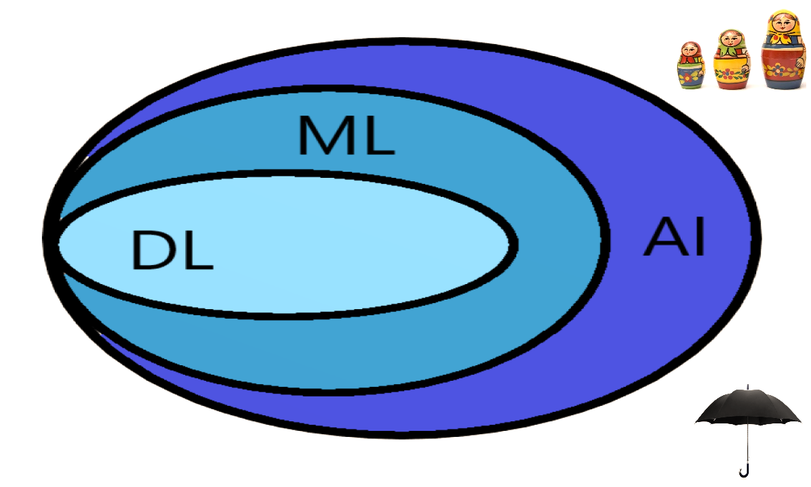

# Agenda

## Definitions & examples
 
- What is Artificial Intelligence? 
- What is Machine Learning?
- What is Deep Learning?

## R ecosystem

- R
- RStudio's IDE for R
- RStudio's other products
- Python in RStudio


## R for Machine Learning 

- caret
- mlr
- parsnip
- xgboost
- lightgbm
- catboost


## R for Deep Learning  

- h2o
- mxnet
- keras
- tensorflow

## R for eXplainable AI

- lime
- shapper
- DALEX
- iml


## R models in production

- API builders
- format converters
- R in cloud
- Docker for R


## Take-home message

- Is R good for DL, ML & AI?


# Artificial Intelligence <br> Machine Learning <br>Deep Learning 


## Artificial Intelligence is an umbrella term




<aside class="notes">

You can think of deep learning, machine learning and artificial intelligence as a set of Russian dolls nested within each other, beginning with the smallest and working out. Deep learning is a subset of machine learning, and machine learning is a subset of AI, which is an umbrella term for any computer program that does something smart.

1. As you can see on the above image, DL is a subset of ML, which is also a subset of **AI**. So, AI is the all-encompassing concept that initially erupted, then followed by ML that thrived later, and lastly DL that is promising to escalate the advances of AI to another level.
2. **ML** can be loosely interpreted to mean empowering computer systems with the ability to “learn”. The intention of ML is to enable machines to learn by themselves using the provided data and make accurate predictions / decisions. ML is a subset of artificial intelligence; in fact, it’s simply a technique for realizing AI.
3. **DL** is a subset of ML; in fact, it’s simply a technique for realizing machine learning. In other words, DL is the next evolution of machine learning. 
</aside>


## AI defined 

> - AI is a computer system able to <mark>*perform tasks that normally require human intelligence*</mark>, such as visual perception, speech recognition, decision-making, and natural language translation.

> - AI is the capability of a machine to  <mark>*imitate intelligent human behavior*</mark>.

## AI exemplified 

considering only those not directly falling into ML or DL category 

> - AI can be a  <mark>pile of if-then statements</mark>, which are rules explicitly programmed by a human hand. Collectively, these if-then statements are sometimes  <mark>called rule engines, expert systems, knowledge graphs or symbolic AI </mark>.

> - AI includes evolutionary computation, often associated with genetic algorithms, successfully used as a competitive alternative for training Deep Neural Networks for Reinforcement Learning.

> - [Skynet](https://betanews.com/wp-content/uploads/2015/07/terminator-900x506.jpg), a fictional artificial neural network-based conscious group mind and artificial general intelligence system from the terminator series.


## ML defined

> - Arthur Samuel (1959): Machine Learning is the field of study that gives computers the <mark>*ability to learn without being explicitly programmed*</mark>.  

> - Machine learning is the science of getting computers to act <mark>*without being explicitly programmed*</mark>.

> - Machine learning is the concept that a computer program can learn and <mark>*adapt to new data without human interference*</mark>. 

> - Machine learning is based on algorithms that can learn from data <mark>*without relying on rule-based programming*</mark>.

> - Machine learning algorithms can figure out how to perform important tasks <mark>*by generalizing from examples*</mark>.


## ML exemplified

considering only those not directly falling into DL category 

> - linear models (LM), generalised linear models (GLM) for non-Gaussian outcomes, generalised additive models (GAM) for non-linear effects etc.

> - [decision trees](https://cdn-images-1.medium.com/max/1200/1*IPLwmH-TJRhEWXW7uaetMw.png), as a powerful and interpretable alternative to linear models & algorithms; ensembles of decision trees for regression and classification (bagging, boosting)


## DL defined

Ian Goodfellow and Aaron Courville in their book titled “Deep Learning” define Deep Learning in terms of the depth of the architecture of the models:

>The hierarchy of concepts allows the computer to learn complicated concepts by building them out of simpler ones. If we draw a graph showing how these concepts are built on top of each other, the graph is deep, with many layers. For this reason, we call this approach to AI <mark>deep learning</mark>.

The above is often simplified to:

>Deep learning is the implementation of neural networks with <mark>more than a single hidden layer</mark> of neurons.


## DL exemplified

A key difference from ML is the ability to perform automatic feature extraction from raw data, also called feature learning.

> - Convolutional Neural Networks (CNN) learn these features for computer vision applications, such as image classification, object detection, semantic segmentation etc. <hrule>

> - Recurrent Neural Networks (RNN) learn these features for natural language processing tasks, such as sentiment analysis, next word prediction, chatbots, speech recognition (Alexa, Siri, Google home), machine reading comprehension, machine translation etc


> - CNN and RNN can be used jointly for automatic image captioning, video processing tasks, e.g. human activity recognition


# R ecosystem 

## R

- [historically](https://cran.r-project.org/doc/html/interface98-paper/paper.html), 
a programming language for statistical computing and graphics 
1st release 1995 / stable beta in 2000 / now 4-5 releases [every year](https://cran.r-project.org/bin/windows/base/old/) 
- highly extensible through the use of user-submitted packages 
```nrow(available.packages())``` returned 14127 [CRAN](https://cran.r-project.org/) 
packages not counting Bioconductor repository, github, gitlab etc
- now, R is more than just a programming language, it's more like an ecosystem with a very active community [very active community](https://www.r-bloggers.com/)


## RStudio

- free and open-source platform-independent [IDE](https://www.rstudio.com/products/rstudio/) for R
- first public beta in Feb 2011 / v1.0 in Nov 2016 / v1.2 in Apr 2019

\

<div class="fragment" data-fragment-index="1">
- available in two editions: RStudio Desktop and RStudio Server
- [commercial products](https://www.rstudio.com/products/rstudio-server-pro/) enterprise-ready professional software for R  
</div>

\


<div class="fragment" data-fragment-index="2">
- [features](https://www.rstudio.com/products/rstudio/features/) integration with version control tools, databases etc
- tools to streamline and simplify creation of R packages
- interactive tools for code profiling, testing, debugging etc

</div>

\

<div class="fragment" data-fragment-index="3">
- great environment for writing [books](https://bookdown.org/yihui/bookdown/), [websites](https://alison.rbind.io/post/up-and-running-with-blogdown/), [slides](https://github.com/rstudio/revealjs) ect
- ability to extend RStudio's functionality via [***addins***](https://rstudio.github.io/rstudioaddins/) 
- centralised searchable repository for all addins (84 addins found) 
</div>


## RStudio's other products

- [R packages](https://www.rstudio.com/products/rpackages/) RStudio team contributes code to many R packages
- [tidyverse](https://www.tidyverse.org/) opinionated collection of R packages for data science
- [shiny](https://shiny.rstudio.com/) Easy web applications in R
- [leaflet](https://rstudio.github.io/leaflet/) interactive maps in R
- [r2d3](https://rstudio.github.io/r2d3/) R Interface to D3 Visualizations
- [sparklyr](https://spark.rstudio.com/) interface to Apache Spark
- [RStudio Connect](https://www.rstudio.com/products/connect/), RStudio Package Manager 
- [Databases](https://db.rstudio.com/) makes it easy to work with databases in R
- [bookdown](https://bookdown.org/) lets you publish your Rmarkdown book for free 
- [webinars](https://resources.rstudio.com/webinars), [cheatsheets](https://www.rstudio.com/resources/cheatsheets/), 
[blog](https://blog.rstudio.com/) etc 
- [rstudio::conf](https://www.rstudio.com/conference/) RStudio's yearly conference

<aside class="notes">
- Connect data scientists with decision makers 
- Package management built for R
</aside>


## Python in RStudio

Two major data science languages: Python and R

<div class="fragment" data-fragment-index="1">
- [RStudio 1.2](https://blog.rstudio.com/categories/rstudio-ide) comes with support for Python, SQL, Stan, D3
- One can now enjoy pandas and seaborn plots in RStudio! 
</div>

\

<div class="fragment" data-fragment-index="2">
- RStudio offers interface to Python via R package [**reticulate**](https://github.com/rstudio/reticulate) 
- RStudio offers interface to Python's major DL libraries 
- One can now enjoy [Keras](https://keras.rstudio.com/) and [TensorFlow](https://tensorflow.rstudio.com/) in RStudio!
</div>

<aside class="notes">

have historically taken two separate paths when it comes to where data scientists are doing the coding. The R language has the RStudio IDE, which is a great IDE for data science because of its feature rich setup for efficiently developing analyses. The Python language has the Jupyter Notebook (and more recently Jupyter Lab) that provides a web-based notebook. Most data scientists write their code in separate places - Python is written in Jupyter Notebooks, and R is written in the RStudio IDE. Until now - RStudio is making the case for a powerful multilanguage IDE designed for Data Science.

RStudio is making the case for a powerful multilanguage IDE designed for Data Science.

reticulate is an RStudio package that provides "a comprehensive set of tools for interoperability between Python and R". With it, it is possible to call Python and use Python libraries within an R session, or define Python chunks in R markdown. I think that using R Notebooks is the best way to work with Python and R; The reticulate package makes it possible to embed a Python session within an R process, allowing you to import Python modules and call their functions directly from R. If you are an R developer that uses Python for some of your work or a member of data science team that uses both languages, reticulate can dramatically streamline your workflow.

</aside>


</section>
<!-- need extra end tag before next section -->
</section>

<section class="titleslide slide level1">
<h1>R for Machine  Learning</h1>

<section style="text-align: left;"><br>

Resources:

<div class="container">

<div class="col">


</div>

<div class="col">

- [Free quality books](https://r4ds.had.co.nz/)

- [RStudio's online learning](https://www.rstudio.com/online-learning/)

- [StackOverflow community](https://stats.stackexchange.com/questions/tagged/r+xgboost)

- [Kaggle competitions](https://www.kaggle.com/kernels?sortBy=voteCount&group=everyone&pageSize=20&language=R)

- [CRAN ML task view](https://cran.r-project.org/web/views/MachineLearning.html)

</div>

</div>


## caret

* short for  [**C**lassification **A**nd **RE**gression **T**raining](http://topepo.github.io/caret/index.html)
* a unified R interface to 160+ different models / algorithms
* in development since 2005 by Max Kuhn & Co
* offer data splitting, pre-processing, feature selection, model tuning using re-sampling, 
variable importance estimation etc
* convenient to learn a single framework's syntax to get predictions from many completing models across different R packages 

## mlr

* short for [**M**achine **L**earning in **R**](https://mlr.mlr-org.com/) 
* re-sampling methods like bootstrapping and cross-validation
* extensive visualizations (e.g. ROC curves, predictions etc)
* variable selection with filters and wrappers
* Hyper-parameter tuning using different optimization strategies
* cost-sensitive learning, threshold tuning and imbalance correction
* **mlr** developers are now working on **mlr3**, a clean rewrite of mlr
* http://philipppro.github.io/2018-11-9-mlr_vs_caret/

## parsnip (new)

* in active development since 2018 by Max Kuhn & Co
* [**parsnip**](https://github.com/tidymodels/parsnip) is a new **tidymodels** package to generalize model interfaces across packages, 
it is further development of some key ideas in *caret* 
* single function interface for types of models, where 
say for linear regression, user chooses computational engine for training e.g. **lm**, **glmnet**, **Spark**, **Stan**, and **Keras**
* designed ***only*** to solve the interface issue, no pre-processing, model tuning, re-sampling ... not designed to be a drop-in replacement for **caret**
* https://www.tidyverse.org/articles/2018/11/parsnip-0-0-1/


## xgboost

Scalable, Portable and Distributed Gradient Boosting (GBDT, GBRT or GBM) Library, for Python, R, Java, Scala, C++ and more. Runs on single machine, Hadoop, Spark, Flink and DataFlow https://xgboost.ai/ an implementation of gradient boosted decision trees designed for speed and performance


- started by Tianqi Chen in March 2014 and became famous in 2016
- stands for “Extreme Gradient Boosting”
- built-in algos to deal with missing values, class imbalance etc   
- GPU support, distributed storage & compute support, e.g. run on AWS EC2 cluster & accessing data on S3
- [latest release changelog](https://github.com/dmlc/xgboost/blob/master/NEWS.md)


## lightgbm (Microsoft)

A fast, distributed, high performance gradient boosting (GBDT, GBRT, GBM or MART) framework based on decision tree algorithms, used for ranking, classification and other machine learning tasks. https://lightgbm.readthedocs.io/en/latest/

- First stable version in Jan 2017
- Faster training speed and higher efficiency
- Lower memory usage
- Better accuracy
- Support of parallel and GPU learning
- Capable of handling large-scale data

## catboost (Yandex)

A fast, scalable, high performance Gradient Boosting on Decision Trees library, 
used for ranking, classification, regression and other machine learning tasks for Python, R, Java, C++. 
Supports computation on CPU and GPU. https://catboost.ai

- Open-sourced in Apr 2017
- Best in class prediction speed
- Support for both numerical and categorical features
- Fast GPU and multi-GPU support for training out of the box
- review of the [latest releases](https://catboost.ai/news/0-10-and-0-9-releases-review) Good news for R users. We implemented GPU support in our R package.


</section>
<!-- need extra end tag before next section -->
</section>

<section class="titleslide slide level1">
<h1>R for Deep Learning</h1>

<section style="text-align: left;"><br>

Resources:

<div class="container">

<div class="col">


</div>

<div class="col">

- [F. Chollet & J. J. Allaire (2018) ***Deep Learning with R***](https://www.manning.com/books/deep-learning-with-r)

- [A. Ghatak (2019) ***Deep Learning with R***](https://www.amazon.com/Deep-Learning-R-Abhijit-Ghatak/dp/9811358494)

- [RStudio's tutorials & examples for Keras](https://keras.rstudio.com/)

</div>

</div>


## h2o 

H2O is an open source, in-memory, distributed, fast, and scalable machine learning and predictive analytics platform that allows you to build machine learning models on big data and provides easy productionalization of those models in an enterprise environment.

- implements multi-layer perceptron & autoencoders
- R, Python, Flow UI use h2o via REST API
- CNNs and RNNs through third-party integrations
- DL capabilities are limited, mostly classical ML at scale
- [h2o DL manual](http://docs.h2o.ai/h2o/latest-stable/h2o-docs/booklets/DeepLearningBooklet.pdf)

<aside class="notes">
- h2o: http://docs.h2o.ai/h2o/latest-stable/h2o-docs/welcome.html
- https://www.analyticsvidhya.com/blog/2016/05/h2o-data-table-build-models-large-data-sets/
- https://towardsdatascience.com/democratising-machine-learning-with-h2o-7f2f79e10e3f
- [h2o tutorial](http://htmlpreview.github.io/?https://github.com/ledell/sldm4-h2o/blob/master/sldm4-deeplearning-h2o.html) &
</aside>


## MXNet

MXNet is a machine-learning framework with APIs is languages such as R, Python and Julia which has been adopted by AWS.

- Deep Learning framework of [choice at AWS](https://www.allthingsdistributed.com/2016/11/mxnet-default-framework-deep-learning-aws.html)
- Limited adoption by the established and aspiring data scientists e.g. at kaggle.com, as compared to e.g. Keras, pytorch and fastai
- [MXNet R tutorials](https://mxnet.incubator.apache.org/versions/master/tutorials/r/index.html)

<aside class="notes">
- https://www.infoworld.com/article/3144025/why-amazon-picked-mxnet-for-deep-learning.html
- https://aws.amazon.com/mxnet/
</aside>


## Keras

[**Keras**](https://keras.rstudio.com/) is a high-level neural networks API developed with a focus on enabling fast experimentation. Being able to go from idea to result with the least possible delay is key to doing good research.

- <font size="5" color="#E7AD52"> Absolutely the best choice for DL an R user can currently enjoy!</font>
- Broad adoption in the industry and in the research community
- Tons of shared code on the Internet e.g. at Kaggle 
- Development is backed Google, Microsoft, Nvidia and AWS
- Allows the same code to run on CPU or on GPU, seamlessly
- Built-in support for CNN, RNN, RNN, LSTM, GRU etc
- Flexibility to build virtually any custom deep learning model

## TensorFlow

The R interface to TensorFlow lets you work productively using either high-level APIs or the core TensorFlow API.

- RStudio's [***TensorFlow for R*** blog](https://blogs.rstudio.com/tensorflow/) is pretty active 
- [**tfruns**](https://blogs.rstudio.com/tensorflow/posts/2017-10-04-tfruns/): Tools for TensorFlow Training Runs
- [**tfdeploy**](https://tensorflow.rstudio.com/tools/): tools designed to make exporting and serving TensorFlow models easy.

NB: while TensorFlow models are typically defined and trained using R or Python code, it is possible to deploy TensorFlow models in a wide variety of environments without any runtime dependency on R or Python


</section>
<!-- need extra end tag before next section -->
</section>


</section>
<!-- need extra end tag before next section -->
</section>


<section class="titleslide slide level1">
<h1>R for eXplainable AI </h1> 

<section style="text-align: left;"><br>

[interpretable-ml-book](https://christophm.github.io/interpretable-ml-book/) Making Black Box Models Explainable

These 4 CRAN packages are in active development:

- [lime](https://github.com/thomasp85/lime) is an R port of the Python library of the same name
- [shapper](https://github.com/ModelOriented/shapper) is an R wrapper of SHAP python library
- [DALEX](https://github.com/pbiecek/DALEX) stands for Descriptive mAchine Learning EXplanations
- [iml](https://github.com/christophM/iml) stands for Interpretable Machine Learning in R

Shapper is a part of the DALEX universe. The DALEX universe is a part of the [DrWhy.AI](https://github.com/ModelOriented/DrWhy/blob/master/README.md) universe, the collection of tools for Explainable AI (XAI). It's based on shared principles and simple grammar for exploration, explanation and visualisation of predictive models.

## [lime](https://github.com/thomasp85/lime)

<div style="float: center"> LIME stands for Local Interpretable Model-agnostic Explanations </div>

<div class="fragment" data-fragment-index="1">
- it explains the predictions of black box classifiers by determining a small set of features in the original data that has driven the outcome of the prediction for any given prediction and any given classifier.
</div>
\
<div class="fragment" data-fragment-index="2">
- supports models created with **caret**, **parsnip** and **mlr** 
- supports explaining image and text models, e.g. by highlighting the relevant areas in an image or important words.
- unsupported models can be supported by adding a *predict_model* and *model_type* method for the given model
</div>


## [shapper](https://github.com/ModelOriented/shapper)

<div style="float: center"> SHAP stands for SHapley Additive exPlanations (SHAP) </div>

<div class="fragment" data-fragment-index="1">
- A unified approach to explain the output of any ML model. 
- R wrapper over Python's SHAP explainer for black-box models
- calculate influences of variables on particular observation, using Shapley values, technique borrowed from game theory. 
</div>
\
<div class="fragment" data-fragment-index="2">
- for each prediction SHAP gives each feature an importance value
- [SHAP approach](https://towardsdatascience.com/understanding-how-ime-shapley-values-explains-predictions-d75c0fceca5a) is also implemented in **iml** or **shapleyR**
- SHAP can be applied to images, text & tabular data
</div>


<aside class="notes">
- http://papers.nips.cc/paper/7062-a-unified-approach-to-interpreting-model-predictions
</aside>

## [DALEX](https://github.com/pbiecek/DALEX)

<div style="float: center"> DALEX stands for Descriptive mAchine Learning EXplanations </div>

<div class="fragment" data-fragment-index="1">
- models based on boosting, bagging or NN are true black boxes
- it is hard to trace the link between features and model outcomes. 
- [DALEX](https://github.com/pbiecek/DALEX) tools help understand how complex models are working
</div>
\
<div class="fragment" data-fragment-index="2">
- supporting keras, parsnip, caret, mlr, h2o, xgboost, catboost etc
- cross-comparison of of model developed in R, Java and Python 
- dump trained model with pickle in Python and pick it up with **reticulate** in R for prediction & explanations
</div>

<aside class="notes">
- https://raw.githack.com/pbiecek/DALEX_docs/master/vignettes/Multilanguages_comparision.html
- https://pbiecek.github.io/DALEX_docs/4-2-predictionBreakdown.html#predictionBreakdown
- https://cran.r-project.org/web/packages/breakDown/index.html
</aside>


## [iml](https://github.com/christophM/iml)

<div style="float: center"> *iml* stands for *i*nterpretable *m*achine *l*earning </div>

<div class="fragment" data-fragment-index="1">
- interprets the behaviour and explains predictions of ML models
- implements model-agnostic interpretability methods, meaning they can be used with any machine learning model:
</div>
\
<div class="fragment" data-fragment-index="2">
- feature importance
- individual conditional expectation plots (ICE)
- accumulated local effects
- tree surrogate
- LocalModel: Local Interpretable Model-agnostic Explanations
- Shapley value for explaining single predictions
</div>


</section>
<!-- need extra end tag before next section -->
</section>


</section>
<!-- need extra end tag before next section -->
</section>


<section class="titleslide slide level1">
<h1>R models in production </h1> 

<section style="text-align: left;"><br>

CRAN task view [ModelDeployment](https://cran.r-project.org/web/views/ModelDeployment.html) reviews R packages, grouped by topic, that provide functionalities to streamline the process of deploying models to various production environments.

## R API builders 


<div class="container">

<div class="col">
- R package [**plumber**](https://github.com/trestletech/plumber) helps creating a web API by merely decorating your R source code with special comments.
- R package [**jug**](https://github.com/Bart6114/jug) is a simple API-builder web framework.
- R package [**RestRServe**](https://github.com/dselivanov/RestRserve) is a web API framework for building high-performance microservices and app backends. 
</div>

<div class="col">

</div>

</div>


<aside class="notes">
- plumber package allows you to create a web API by merely decorating your existing R source code with special comments. The jug package is a simple API-builder web framework
- The main difference with other frameworks (plumber, jug) is that it is parallel by design.
</aside>


## R converters

- R package [**R2PMML**](https://github.com/jpmml/r2pmml) provides the interface to Predictive Model Markup Language (PMML) format
- R package [**onnx**](https://github.com/onnx/onnx-r) provides the interface to Open Neural Network Exchange i.e. [ONNX](https://onnx.ai/) 
- R package [**aurelius**](https://github.com/opendatagroup/hadrian/tree/master/aurelius) provides tools for converting R objects and syntax into the Portable Format for Analytics i.e. [PFA](http://dmg.org/pfa/). Check out this [post](https://stevenmortimer.com/pfa-with-the-r-package-aurelius/) for further detail.

<aside class="notes">

- is an XML-based language which provides a way for applications to define statistical and data mining models and to share models between PMML compliant applications.

- Models trained in one framework can be easily transferred to another framework for inference. This open source format enables the interoperability between different frameworks and streamlining the path from research to production will increase the speed of innovation in the AI community. Note that this package is based on the reticulate package to interface with the original Python API so Python binary is required for deployment. http://dmg.org/pfa/]

</aside>

## R in cloud

- [AWS Sagemaker via Jupyter notebook or R Studio](http://www.rpubs.com/TimFlocke/SageMaker_R_demo) the latter 
option is possible by **reticulating** the Amazon SageMaker Python SDK

- R package [**cloudml**](https://tensorflow.rstudio.com/tools/cloudml/articles/deployment.html) provides functionality to easily deploy models to [Google Cloud ML Engine](https://cloud.google.com/ml-engine/)


## Docker for R 

Docker allows you to wrap up your R product in a self contained mini computer that can then be easily shared and run in a variety of different environments. 

Docker file builds docker image which runs docker container.

- [The Rocker Project](https://www.rocker-project.org/) Docker Containers for the R Environment

- [Dockerfile for GPU enabled rstudio server with keras+tensorflow](https://github.com/pbhogale/gpu-keras-rstudio) <br> to run the code from the Deep learning in R book given an NVIDIA GPU with drivers installed. 


<aside class="notes">

Docker is an open source project based on Linux containers. It is a tool designed to make it easier to create, deploy, and run applications using containers. Containers allows you to package up an application with all of it’s libraries and other dependencies, and ship it all out as one package. Docker containers are very lightweight and fast.

- https://www.bioconductor.org/packages/release/bioc/vignettes/sevenbridges/inst/doc/rstudio.html
- https://colinfay.me/docker-r-reproducibility/
- https://chapmandu2.github.io/post/2019/02/02/dockerizing-your-r-analysis/
- https://towardsdatascience.com/ml-models-prototype-to-production-6bfe47973123
</aside>


</section>
<!-- need extra end tag before next section -->
</section>


</section>
<!-- need extra end tag before next section -->
</section>


<section class="titleslide slide level1">
<h1>Take-home message</h1> 

<section style="text-align: left;">

- R is world’s most widely used statistics programming language.
- R is great for data analysis, data visualization, data munging.

\
<div class="fragment" data-fragment-index="1">
- R is a solid choice for machine learning, including deep learning.
- R is a solid choice for AI, including eXplainable AI
</div>

\
<div class="fragment" data-fragment-index="2">


<div class="container">


<div class="col">

- R or Python? Wrong question. Why not both?
- RStudio makes the joint use of R and Python easy.
- Take the best of two worlds!
</div>


</div>


</section>


<!-- need extra end tag before next section -->
</section>


</section>
<!-- need extra end tag before next section -->
</section>

<section class="titleslide slide level1" data-background-image="images/ai3.jpg">
<h1 style="color:red;"><br>Questions?</h1> 

<section style="text-align: left;"><br>


<br>
<br>
<br>
<br>

<br>

- Website: <br> [http://andreykostenko.com](http://andreykostenko.com/)

- LinkedIn: <br> [https://www.linkedin.com/in/akoste01/](https://www.linkedin.com/in/akoste01/)

<h1 style="color:white;text-align: center;">Thank you</h1>

</section>


<!-- need extra end tag before next section -->
</section>


<style>
.container{
    display: flex;
}
.col{
    flex: 1;
    justify-content: center;
    align-self: center;
    flex-direction: column;
    margin: 5px;  /* and that, will result in a 10px gap */
}

</style>